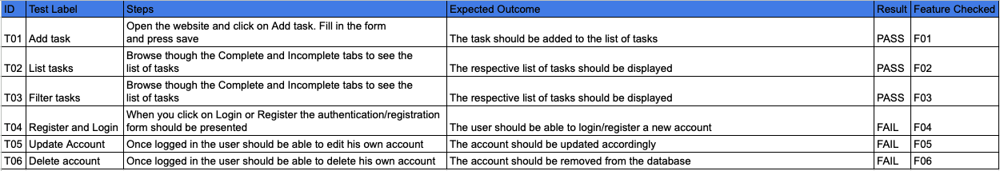

# Task Manager
## Project Portfolio 5

[Frontend: Link to the deployed Heroku app](https://task-manager-pp5.herokuapp.com/)

[Frontend: Link to the GitHub repository](https://github.com/ujuniordev/task-manager-pp5/)

[Backend: Link to the deployed Heroku app](https://drf-task-manager.herokuapp.com/)

[Backend: Link to the GitHub repository](https://github.com/ujuniordev/drf-task-manager/)

Task Manager application
## About the website

The task manager application was develop to provide the user with a tool to help him manage his daily tasks easily and quickly.

## User experience

The main goal of this app is to provide users with an easy way to manage their tasks. The site features a clean, simple, and intuitive interface that guides users seamlessly through the following actions:
- Creating tasks
- Updating tasks
- Viewing a list of tasks
- Deleting tasks
- Viewing own profile
- Updating own profile
- Deleting own profile
- Contact form

The development of the site was based on the following user stories:

 - **US 01 Add Task**

As a **desktop and mobile user,** I want to be able to **create a task** so that **I can maintain a list of tasks**.
- **US #02 Update a Task**

As a **desktop and mobile user**, I want the option to **update a task** so that **I can modify the requirements if necessary**.
- **US #03 delete a task**

As a **desktop and mobile user**, I want the option to **delete a task** so that **I can remove unnecessary tasks from those in progress**.
- **US #04 Filter Tasks**

As a **desktop and mobile user**, I want the ability to **filter tasks by status** so that **I can easily view completed tasks and those in progress**.
- **US #05 View List of Tasks**

As a **desktop and mobile user**, I want to be able to **view the list of tasks** so that **I can easily see all tasks on the list**.
- **US #06 Register**

As a **desktop and mobile user**, I want the option to **register** so that **I can create an account in the task manager**.
- **US #07 Login**

As a **desktop and mobile user**, I want the option to **login** so that **I can access my account**.
- **US #08 Update Account Details**

As a **desktop and mobile user**, I want the option to **update my account details** so that **I can keep my information up to date**.
- **US #09 Delete Account**

As a **desktop and mobile user**, I want the option to **delete my account** so that **I can close it if necessary or desired**.
- **US #10 Contact me form**

As a **desktop and mobile user**, I want the option to **contact the application support** so that **I can clarify questions or report any issue**.

By focusing on these user stories and their corresponding features, the app ensures a user-friendly experience that allows for efficient task management and account customization.

## Design
Creating a design that offers a clean and intuitive interface, while ensuring clarity for users in identifying where their input is requested, was a paramount objective in the development process. To achieve this, careful consideration was given to the selection and implementation of design elements.

One of the key aspects in achieving a cohesive and visually appealing design was the utilization of Bootstrap elements as the primary source of color, fonts, and text choices. Bootstrap, a popular front-end framework, provided a robust set of pre-defined styles and components that seamlessly integrated into the design system.

For the color scheme, Bootstrap's predefined color palette was employed to maintain consistency throughout the interface. By leveraging the Bootstrap color classes, harmonious shades were applied to different interface elements, ensuring a visually balanced and pleasing experience for users. Colors used: Very dark grayish blue for the navbar, blue for the buttons and red for the incomplete tasks' tab placed on a white background.

In terms of typography, Bootstrap's extensive collection of fonts and text styles played a vital role in creating a cohesive design language. The carefully selected fonts not only ensured legibility and readability but also added a touch of elegance to the overall aesthetic. The use of font classes and utility styles from Bootstrap made it effortless to maintain consistency across different sections of the interface.

To enhance the intuitiveness of the interface, particular attention was paid to visual cues and indicators that clearly guided users to the areas where their input was required. Through the use of Bootstrap's form components, such as input fields, labels, and buttons, a seamless and intuitive input experience was achieved. Clear and concise instructions were provided, accompanied by appropriate feedback and validation messages, ensuring that users understood where and how to provide their input.

Throughout the design process, user feedback and usability testing played a vital role in refining the interface further. Iterative improvements were made based on insights gathered from user interactions, helping to fine-tune the design and optimize its intuitiveness.
In conclusion, the creation of a design with a clean and intuitive interface, where users can easily identify where their input is requested, relied heavily on the utilization of Bootstrap elements as the primary source of color, fonts, and text choices. By leveraging Bootstrap's extensive set of styles and components, a visually cohesive and user-friendly experience was achieved, ultimately meeting the objectives of the design project.

## Features

This website incorporates several features and pages that have been developed with consideration for the user stories mentioned in the "User Experience" section above. All of these features are designed to be responsive, enabling smooth navigation on any device. However, please note that not all features have been fully developed. 

The agile MoSCoW method was employed to prioritize and determine which features would be implemented.

- **F#01 Add Task (using US#01)**

The "Add Task" button serves as the central feature of the task manager, allowing users to create a list of tasks to be completed. Upon clicking the "Add Task" button, a modal window opens, providing users with a space to input the task details.
- **F#02 List of Tasks (using US#02, US#03, US#05)**

The "List of Tasks" page displays all tasks created by the user within the task manager. It offers three primary functions: viewing the list of tasks, updating task details, and deleting tasks. Each task entry includes an "Update" button, which opens a modal window for users to modify and save task details, as well as a "Delete" button, which instantly removes the task from the list upon clicking.

- **F#03 Filter Tasks (using US#04)**

The "Filter Tasks" feature enables users to sort tasks based on their status, providing two options: "Completed" and "Incomplete." By selecting either option, the task list is automatically updated to display the relevant tasks.

- **F#04 Register & Login (using US#06, US#07)**

Upon entering the app, users are presented with two options: "Register" and "Login." Choosing "Register" leads to a form where users can input the necessary details to create an account. Opting for "Login" redirects users to the login form, where they can enter their login credentials to access the app.

- **F#05 Update Account (using US#08)**

On the account details page, users have the ability to update their account information by simply modifying the content within the input fields and clicking "Save."

- **F#06 Delete Account (using US#09)**

On the account details page, users can choose to delete their account by clicking the "Delete" button.

- **F#07 Contact me (using US#10)**

On the Contact me page the users can send a message to the site admin to clarify questions or report any issues. The contact form has a subject and a message field. The message is sent as soon as the user hits the submit button and a feedback message is displayed to the user.

These features and pages collectively enhance the usability and functionality of the app, providing users with a seamless experience for managing tasks and personal account settings.

### Prioritization of Feature Development
During the development process, prioritizing the features was essential to ensure efficient resource allocation and timely delivery of the product. The agile MoSCoW method was employed to determine the order in which the features would be implemented, categorizing them into four priority levels: Must-have, Should-have, Could-have, and Won't-have. This prioritization approach allowed the development team to focus on delivering the core functionality while providing flexibility for future iterations and enhancements.

- Must-have Features (M): The must-have features were considered crucial for the basic functionality and core user experience of the task management app. These features directly addressed the fundamental requirements outlined in the user stories, such as adding tasks, viewing the task list, and registering/login into the app. Implementing these features was the top priority to ensure the primary purpose of the app could be fulfilled effectively.

- Should-have Features (S): The should-have features were considered important for enhancing the user experience and providing additional functionality to the app. These features included updating tasks, filtering tasks, and updating account details. While not essential for the core functionality, these features played a significant role in improving usability and allowing users to customize their experience. Developing these features was the next priority after completing the must-have features.

- Could-have Features (C): The could-have features were identified as desirable but not critical for the initial release. These features, such as deleting tasks and deleting the account, provided additional convenience and flexibility to users. While not prioritized for immediate implementation, they remained on the development roadmap for future iterations or updates, depending on available resources and project timelines.

- Won't-have Features (W): The won't-have features were features that, after careful consideration, were deemed unnecessary for the core functionality or outside the scope of the initial release. These features were set aside to avoid scope creep and maintain a focus on delivering the essential functionalities of the task management app. However, they could be revisited and considered for future development cycles or as part of feature enhancements based on user feedback and evolving needs.

By employing the MoSCoW method, we were able to prioritize feature implementation based on their importance and impact on the overall user experience. This approach ensured that the core functionality was delivered efficiently while allowing for flexibility in accommodating additional features in future iterations, ultimately enhancing the app's capabilities and meeting user expectations.

Below you can find a table listing the features and the correspond prioritization state:

| Feature | MoSCow | Comments |
|--|--|--|
| F#01: Add Task | Must Have | Core functionality |
| F#02: List of Tasks (includes update and delete tasks) | Must Have | Core functionality |
| F#03: Filter Tasks (by complete and incomplete)|Must Have|Core functionality|
| F#04: Register & Login | Must Have | Core functionality |
| F#05: Update Account | Should Have | User profile management |
| F#06: Delete Account | Should Have | User profile management |
| F#07: Contact form | Should have | Should have as an extra module |

### Features to be implemented

- Reminders and Notifications:
Set reminders and notifications for tasks.
Options for email, push notifications, and calendar integration.

- Task Priority and Urgency:
Ability to assign priorities (e.g., high, medium, low) to tasks.
Highlight or flag urgent tasks.

- Task Dependencies:
Define task dependencies and relationships (e.g., task A must be completed before task B).
Visualize dependencies in a Gantt chart or similar format.

- Recurring Tasks:
Create recurring tasks (e.g., daily, weekly, monthly).
Specify the recurrence pattern and end dates.

- Task Collaboration:
Share tasks or projects with team members.
Assign tasks to specific users and track their progress.

- Notes and Attachments:
Add notes, comments, or attachments to tasks.
Store relevant documents or links related to tasks.

- Time Tracking: 
Record time spent on tasks.
Generate time reports or charts for analysis.

- Goal Setting and Planning:
Set long-term goals and break them down into tasks.
Visualize progress toward goals.

## Technologies

The development of the task management app involved the use of several technologies to create a robust and interactive user interface, as well as to handle the underlying functionality. The following technologies were chosen for their effectiveness, versatility, and compatibility with the project requirements:

 - HTML (Hypertext Markup Language): HTML was utilized as the foundational language for structuring the web pages of the app. It provided the necessary elements and semantics to organize the content and ensure proper rendering across different devices and browsers.

 - JSX (JavaScript XML): JSX, an extension of JavaScript, was employed in combination with React, a popular JavaScript library, to build the interactive components and user interface of the app. JSX facilitated the seamless integration of JavaScript logic with HTML-like syntax, enabling the development team to create reusable and modular components.

 - CSS (Cascading Style Sheets): CSS played a vital role in designing the visual presentation and layout of the app. It was utilized to customize the styling, color schemes, and overall aesthetics of the user interface. CSS frameworks, such as Bootstrap, were also utilized to ensure a responsive and consistent design across different devices.

 - Python: Python was chosen as the primary backend programming language for its simplicity, versatility, and extensive ecosystem of libraries and frameworks. Python facilitated the implementation of server-side functionalities, such as handling requests, managing databases, and implementing business logic.

 - JavaScript: JavaScript was used extensively for client-side interactivity and dynamic behavior of the app. It enabled real-time updates, form validation, and asynchronous operations, enhancing the overall user experience.

 These technologies were selected based on their compatibility with each other, as well as their suitability for building a modern, responsive, and feature-rich task management app. Leveraging these technologies allowed for efficient development, code maintainability, and scalability, ensuring a seamless user experience while handling the underlying functionalities effectively.
 
## Frameworks, Programs and code websites references used during the implementation

### Frameworks

- [Git](https://git-scm.com/) was used for version control through [Gitpod](https://gitpod.io/) terminal, using CLI git commands to commit and push to GitHub
- [GitHub](https://github.com/) is used as the repository for the entire project
- [Heroku](https://www.heroku.com/) was used to deploy the application as it runs on the terminal
- [Bootstrap](https://getbootstrap.com/) was used for design, content positioning and styling.
- [Reactstrap](https://reactstrap.github.io/) together with bootstrap was used for design, content positioning and styling.
- [Django Rest Framework](https://www.django-rest-framework.org/) was the main backend development framework.
- [React.js](https://react.dev/) was used to develop the front end of the web application.

### Code

- During the implementation of the website, it was made necessary to look for examples and of code and different ways to achieve the required goal. Therefore a couple of community websites were used, such as the [W3C Schools website](https://www.w3schools.com/) that was extensively used to check the syntax and code examples

- [Django Rest Framework](https://www.django-rest-framework.org/) documentation was often consulted to check code syntax and other functions.

- [Stack Overflow](https://stackoverflow.com/) was also referenced to check Python function methods and iteration methods and to help understand and fix issues witht he code

- And of course, the [Code Institute LMS](https://learn.codeinstitute.net/) was extensively used especially the Codestar blog walkthrough project.
- With the help from [Real Python](https://realpython.com/django-social-network-1/), [Digital Ocean](https://www.digitalocean.com/) and [SAASitive](https://saasitive.com/) I was able to build most of the features of the website.

## Testing

The testing plan was based on the features described for the website.

## Deployment

The project was deployed using the Heroku mock terminal from Code Institue. The steps for deployment are as follows:

- Create a new repository in GitHub
- Create new workspace by clicking 'Gitpod' button.
- Once the workspace has loaded, run terminal command  **npx create-react-app . --use-npm**  to create React app.  
- Once the app is installed, run terminal command  **npm start**  to check app is working. Browser should open with the spinning React logo on a dark blue background.  
- Confirm the changes have rendered in the browser preview then add, commit and push changes.
- Log in to Heroku and create new app".
- Click on the 'Deploy' tab and go to 'Deployment Method'. Click on GitHub.
- Go to 'Manual Deploy' section and click 'Deploy Branch'. Click on 'build logs' to monitor build and ensure deployment is successful. Build is complete when log states 'Build succeeded!'. 
- Click 'Open App' button to view newly deployed app.